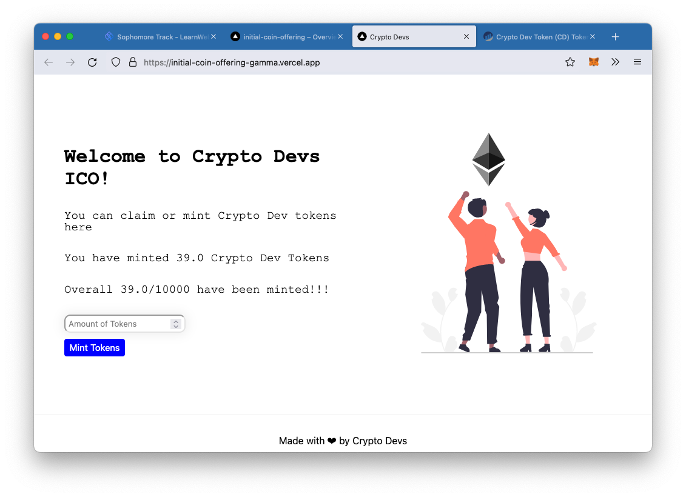

# NFT-Collection
Project following [LearnWeb3DAO Sophmore track](https://www.learnweb3.io/tracks/sophomore) to create the smart
contract and front end for a token ICO. This project builds upon the functionality
from [andy-shearer/nft-collection](https://github.com/andy-shearer/nft-collection), allowing a number of tokens
to be claimed based off the amount of [Crypto Dev](https://testnets.opensea.io/collection/crypto-devs-8augk18k1q) 
NFTs owned.

Built using hardhat and next.js - see both README files in the relevant subdirectories 
([hardhat](./hardhat/README.md) / [next.js](./my-app/README.md))

Deployed to: https://initial-coin-offering-gamma.vercel.app/

